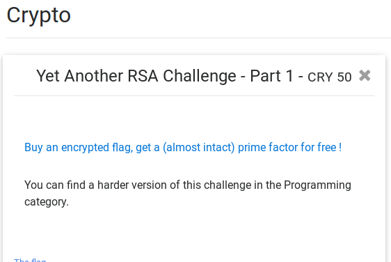
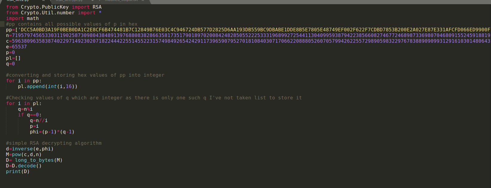

# Yet Another RSA Challenge - Part 1

__PROBLLEM__




__HINT__
Buy an encrypted flag, get a (almost intact) prime factor for free !

__SOLUTION__

This is a simple RSA challenge. We are provided with a  tar.gz which has [Encryption file](yarsac.py) and [output file](output.txt).
At the time we have value of 'n' ,'e','c' , and distorted 'p' in output.txt .
We can see that some "FC" in 'p' has been replaced with "9F" 

```

N: 719579745653303119025873098043848913976880838286635817351790189702008424828505522253331968992725441130409959387942238566082746772468987336980704680915524591881919460709921709513741059003955050088052599067720107149755856317364317707629467090624585752920523062378696431510814381603360130752588995217840721808871896469275562085215852034302374902524921137398710508865248881286824902780186249148613287250056380811479959269915786545911048030947364841177976623684660771594747297272818410589981294227084173316280447729440036251406684111603371364957690353449585185893322538541593242187738587675489180722498945337715511212885934126635221601469699184812336984707723198731876940991485904637481371763302337637617744175461566445514603405016576604569057507997291470369704260553992902776099599438704680775883984720946337235834374667842758010444010254965664863296455406931885650448386682827401907759661117637294838753325610213809162253020362015045242003388829769019579522792182295457962911430276020610658073659629786668639126004851910536565721128484604554703970965744790413684836096724064390486888113608024265771815004188203124405817878645103282802994701531113849607969243815078720289912255827700390198089699808626116357304202660642601149742427766381

e: 65537

ciphertext (c): 596380963583874022971492302071822444225514552231574984926542429117396590795270181084030717066220888052607057994262255729890598322976783889090993129161030148064314476199052180347747135088933481343974996843632511300255010825580875930722684714290535684951679115573751200980708359500292172387447570080875531002842462002727646367063816531958020271149645805755077133231395881833164790825731218786554806777097126212126561056170733032553159740167058242065879953688453169613384659653035659118823444582576657499974059388261153064772228570460351169216103620379299362366574826080703907036316546232196313193923841110510170689800892941998845140534954264505413254429240789223724066502818922164419890197058252325607667959185100118251170368909192832882776642565026481260424714348087206462283972676596101498123547647078981435969530082351104111747783346230914935599764345176602456069568419879060577771404946743580809330315332836749661503035076868102720709045692483171306425207758972682717326821412843569770615848397477633761506670219845039890098105484693890695897858251238713238301401843678654564558196040100908796513657968507381392735855990706254646471937809011610992016368630851454275478216664521360246605400986428230407975530880206404171034278692756

p(distorted in HEX):
0xDCC5A0BD3A1FC0BEB0DA1C2E8CF6B474481B7C12849B76E03C4C946724DB577D2825D6AA193DB559BC9DBABE1DDE8B5E7805E48749EF002F622F7CDBD7853B200E2A027E87E331AFCFD066ED9900F1E5F5E5196A451A6F9E329EB889D773F08E5FBF45AACB818FD186DD74626180294DCC31805A88D1B71DE5BFEF3ED01F12678D906A833A78EDCE9BDAF22BBE45C0BFB7A82AFE42C1C3B8581C83BF43DFE31BFD81527E507686956458905CC9A660604552A060109DC81D01F229A264AB67C6D7168721AB36DE769CEAFB97F238050193EC942078DDF5329A387F46253A4411A9C8BB71F9AEB11AC9623E41C14FCD2739D76E69283E57DDB11FC531B4611EE3

```
-> I've made combinations of 'p' that may be possible and calculated q=n/p for which 'q' is integer and got the required 'q' and corresponding 'p'
-> Then followed the simple RSA decryption Algorithm.

------------combination of suspected p by replacing 1 , 2, 3, FC at a time with 9F----------------------

```
p='DCC5A0BD3A19F0BEB0DA1C2E8CF6B474481B7C12849B76E03C4C946724DB577D2825D6AA193DB559BC9DBABE1DDE8B5E7805E48749EF002F622F7CDBD7853B200E2A027E87E331AFCFD066ED9900F1E5F5E5196A451A6F9E329EB889D773F08E5FBF45AACB818FD186DD74626180294DCC31805A88D1B71DE5BFEF3ED01F12678D906A833A78EDCE9BDAF22BBE45C0BFB7A82AFE42C1C3B8581C83BF43DFE31BFD81527E507686956458905CC9A660604552A060109DC81D01F229A264AB67C6D7168721AB36DE769CEAFB97F238050193EC942078DDF5329A387F46253A4411A9C8BB71F9AEB11AC9623E41C14FCD2739D76E69283E57DDB11FC531B4611EE3'

p='DCC5A0BD3A1FC0BEB0DA1C2E8CF6B474481B7C12849B76E03C4C946724DB577D2825D6AA193DB559BC9DBABE1DDE8B5E7805E48749EF002F622F7CDBD7853B200E2A027E87E331A9FFD066ED9900F1E5F5E5196A451A6F9E329EB889D773F08E5FBF45AACB818FD186DD74626180294DCC31805A88D1B71DE5BFEF3ED01F12678D906A833A78EDCE9BDAF22BBE45C0BFB7A82AFE42C1C3B8581C83BF43DFE31BFD81527E507686956458905CC9A660604552A060109DC81D01F229A264AB67C6D7168721AB36DE769CEAFB97F238050193EC942078DDF5329A387F46253A4411A9C8BB71F9AEB11AC9623E41C14FCD2739D76E69283E57DDB11FC531B4611EE3'

p='DCC5A0BD3A1FC0BEB0DA1C2E8CF6B474481B7C12849B76E03C4C946724DB577D2825D6AA193DB559BC9DBABE1DDE8B5E7805E48749EF002F622F7CDBD7853B200E2A027E87E331AFCFD066ED9900F1E5F5E5196A451A6F9E329EB889D773F08E5FBF45AACB818FD186DD74626180294DCC31805A88D1B71DE5BFEF3ED01F12678D906A833A78EDCE9BDAF22BBE45C0BFB7A82AFE42C1C3B8581C83BF43DFE31BFD81527E507686956458905CC9A660604552A060109DC81D01F229A264AB67C6D7168721AB36DE769CEAFB97F238050193EC942078DDF5329A387F46253A4411A9C8BB71F9AEB11AC9623E41C149FD2739D76E69283E57DDB11FC531B4611EE3'

p='DCC5A0BD3A1FC0BEB0DA1C2E8CF6B474481B7C12849B76E03C4C946724DB577D2825D6AA193DB559BC9DBABE1DDE8B5E7805E48749EF002F622F7CDBD7853B200E2A027E87E331AFCFD066ED9900F1E5F5E5196A451A6F9E329EB889D773F08E5FBF45AACB818FD186DD74626180294DCC31805A88D1B71DE5BFEF3ED01F12678D906A833A78EDCE9BDAF22BBE45C0BFB7A82AFE42C1C3B8581C83BF43DFE31BFD81527E507686956458905CC9A660604552A060109DC81D01F229A264AB67C6D7168721AB36DE769CEAFB97F238050193EC942078DDF5329A387F46253A4411A9C8BB71F9AEB11AC9623E41C14FCD2739D76E69283E57DDB119F531B4611EE3'

p='DCC5A0BD3A19F0BEB0DA1C2E8CF6B474481B7C12849B76E03C4C946724DB577D2825D6AA193DB559BC9DBABE1DDE8B5E7805E48749EF002F622F7CDBD7853B200E2A027E87E331A9FFD066ED9900F1E5F5E5196A451A6F9E329EB889D773F08E5FBF45AACB818FD186DD74626180294DCC31805A88D1B71DE5BFEF3ED01F12678D906A833A78EDCE9BDAF22BBE45C0BFB7A82AFE42C1C3B8581C83BF43DFE31BFD81527E507686956458905CC9A660604552A060109DC81D01F229A264AB67C6D7168721AB36DE769CEAFB97F238050193EC942078DDF5329A387F46253A4411A9C8BB71F9AEB11AC9623E41C149FD2739D76E69283E57DDB119F531B4611EE3'

p='DCC5A0BD3A19F0BEB0DA1C2E8CF6B474481B7C12849B76E03C4C946724DB577D2825D6AA193DB559BC9DBABE1DDE8B5E7805E48749EF002F622F7CDBD7853B200E2A027E87E331A9FFD066ED9900F1E5F5E5196A451A6F9E329EB889D773F08E5FBF45AACB818FD186DD74626180294DCC31805A88D1B71DE5BFEF3ED01F12678D906A833A78EDCE9BDAF22BBE45C0BFB7A82AFE42C1C3B8581C83BF43DFE31BFD81527E507686956458905CC9A660604552A060109DC81D01F229A264AB67C6D7168721AB36DE769CEAFB97F238050193EC942078DDF5329A387F46253A4411A9C8BB71F9AEB11AC9623E41C14FCD2739D76E69283E57DDB11FC531B4611EE3'

p='DCC5A0BD3A19F0BEB0DA1C2E8CF6B474481B7C12849B76E03C4C946724DB577D2825D6AA193DB559BC9DBABE1DDE8B5E7805E48749EF002F622F7CDBD7853B200E2A027E87E331AFCFD066ED9900F1E5F5E5196A451A6F9E329EB889D773F08E5FBF45AACB818FD186DD74626180294DCC31805A88D1B71DE5BFEF3ED01F12678D906A833A78EDCE9BDAF22BBE45C0BFB7A82AFE42C1C3B8581C83BF43DFE31BFD81527E507686956458905CC9A660604552A060109DC81D01F229A264AB67C6D7168721AB36DE769CEAFB97F238050193EC942078DDF5329A387F46253A4411A9C8BB71F9AEB11AC9623E41C149FD2739D76E69283E57DDB11FC531B4611EE3'

p='DCC5A0BD3A19F0BEB0DA1C2E8CF6B474481B7C12849B76E03C4C946724DB577D2825D6AA193DB559BC9DBABE1DDE8B5E7805E48749EF002F622F7CDBD7853B200E2A027E87E331AFCFD066ED9900F1E5F5E5196A451A6F9E329EB889D773F08E5FBF45AACB818FD186DD74626180294DCC31805A88D1B71DE5BFEF3ED01F12678D906A833A78EDCE9BDAF22BBE45C0BFB7A82AFE42C1C3B8581C83BF43DFE31BFD81527E507686956458905CC9A660604552A060109DC81D01F229A264AB67C6D7168721AB36DE769CEAFB97F238050193EC942078DDF5329A387F46253A4411A9C8BB71F9AEB11AC9623E41C14FCD2739D76E69283E57DDB119F531B4611EE3'

p='DCC5A0BD3A1FC0BEB0DA1C2E8CF6B474481B7C12849B76E03C4C946724DB577D2825D6AA193DB559BC9DBABE1DDE8B5E7805E48749EF002F622F7CDBD7853B200E2A027E87E331A9FFD066ED9900F1E5F5E5196A451A6F9E329EB889D773F08E5FBF45AACB818FD186DD74626180294DCC31805A88D1B71DE5BFEF3ED01F12678D906A833A78EDCE9BDAF22BBE45C0BFB7A82AFE42C1C3B8581C83BF43DFE31BFD81527E507686956458905CC9A660604552A060109DC81D01F229A264AB67C6D7168721AB36DE769CEAFB97F238050193EC942078DDF5329A387F46253A4411A9C8BB71F9AEB11AC9623E41C149FD2739D76E69283E57DDB11FC531B4611EE3'

p='DCC5A0BD3A1FC0BEB0DA1C2E8CF6B474481B7C12849B76E03C4C946724DB577D2825D6AA193DB559BC9DBABE1DDE8B5E7805E48749EF002F622F7CDBD7853B200E2A027E87E331A9FFD066ED9900F1E5F5E5196A451A6F9E329EB889D773F08E5FBF45AACB818FD186DD74626180294DCC31805A88D1B71DE5BFEF3ED01F12678D906A833A78EDCE9BDAF22BBE45C0BFB7A82AFE42C1C3B8581C83BF43DFE31BFD81527E507686956458905CC9A660604552A060109DC81D01F229A264AB67C6D7168721AB36DE769CEAFB97F238050193EC942078DDF5329A387F46253A4411A9C8BB71F9AEB11AC9623E41C14FCD2739D76E69283E57DDB119F531B4611EE3'

p='DCC5A0BD3A1FC0BEB0DA1C2E8CF6B474481B7C12849B76E03C4C946724DB577D2825D6AA193DB559BC9DBABE1DDE8B5E7805E48749EF002F622F7CDBD7853B200E2A027E87E331AFCFD066ED9900F1E5F5E5196A451A6F9E329EB889D773F08E5FBF45AACB818FD186DD74626180294DCC31805A88D1B71DE5BFEF3ED01F12678D906A833A78EDCE9BDAF22BBE45C0BFB7A82AFE42C1C3B8581C83BF43DFE31BFD81527E507686956458905CC9A660604552A060109DC81D01F229A264AB67C6D7168721AB36DE769CEAFB97F238050193EC942078DDF5329A387F46253A4411A9C8BB71F9AEB11AC9623E41C149FD2739D76E69283E57DDB119F531B4611EE3'

p='DCC5A0BD3A19F0BEB0DA1C2E8CF6B474481B7C12849B76E03C4C946724DB577D2825D6AA193DB559BC9DBABE1DDE8B5E7805E48749EF002F622F7CDBD7853B200E2A027E87E331A9FFD066ED9900F1E5F5E5196A451A6F9E329EB889D773F08E5FBF45AACB818FD186DD74626180294DCC31805A88D1B71DE5BFEF3ED01F12678D906A833A78EDCE9BDAF22BBE45C0BFB7A82AFE42C1C3B8581C83BF43DFE31BFD81527E507686956458905CC9A660604552A060109DC81D01F229A264AB67C6D7168721AB36DE769CEAFB97F238050193EC942078DDF5329A387F46253A4411A9C8BB71F9AEB11AC9623E41C149FD2739D76E69283E57DDB11FC531B4611EE3'

p='DCC5A0BD3A19F0BEB0DA1C2E8CF6B474481B7C12849B76E03C4C946724DB577D2825D6AA193DB559BC9DBABE1DDE8B5E7805E48749EF002F622F7CDBD7853B200E2A027E87E331AFCFD066ED9900F1E5F5E5196A451A6F9E329EB889D773F08E5FBF45AACB818FD186DD74626180294DCC31805A88D1B71DE5BFEF3ED01F12678D906A833A78EDCE9BDAF22BBE45C0BFB7A82AFE42C1C3B8581C83BF43DFE31BFD81527E507686956458905CC9A660604552A060109DC81D01F229A264AB67C6D7168721AB36DE769CEAFB97F238050193EC942078DDF5329A387F46253A4411A9C8BB71F9AEB11AC9623E41C149FD2739D76E69283E57DDB119F531B4611EE3'

p='DCC5A0BD3A19F0BEB0DA1C2E8CF6B474481B7C12849B76E03C4C946724DB577D2825D6AA193DB559BC9DBABE1DDE8B5E7805E48749EF002F622F7CDBD7853B200E2A027E87E331A9FFD066ED9900F1E5F5E5196A451A6F9E329EB889D773F08E5FBF45AACB818FD186DD74626180294DCC31805A88D1B71DE5BFEF3ED01F12678D906A833A78EDCE9BDAF22BBE45C0BFB7A82AFE42C1C3B8581C83BF43DFE31BFD81527E507686956458905CC9A660604552A060109DC81D01F229A264AB67C6D7168721AB36DE769CEAFB97F238050193EC942078DDF5329A387F46253A4411A9C8BB71F9AEB11AC9623E41C14FCD2739D76E69283E57DDB119F531B4611EE3'

p='DCC5A0BD3A1FC0BEB0DA1C2E8CF6B474481B7C12849B76E03C4C946724DB577D2825D6AA193DB559BC9DBABE1DDE8B5E7805E48749EF002F622F7CDBD7853B200E2A027E87E331A9FFD066ED9900F1E5F5E5196A451A6F9E329EB889D773F08E5FBF45AACB818FD186DD74626180294DCC31805A88D1B71DE5BFEF3ED01F12678D906A833A78EDCE9BDAF22BBE45C0BFB7A82AFE42C1C3B8581C83BF43DFE31BFD81527E507686956458905CC9A660604552A060109DC81D01F229A264AB67C6D7168721AB36DE769CEAFB97F238050193EC942078DDF5329A387F46253A4411A9C8BB71F9AEB11AC9623E41C149FD2739D76E69283E57DDB119F531B4611EE3'

p='DCC5A0BD3A1FC0BEB0DA1C2E8CF6B474481B7C12849B76E03C4C946724DB577D2825D6AA193DB559BC9DBABE1DDE8B5E7805E48749EF002F622F7CDBD7853B200E2A027E87E331AFCFD066ED9900F1E5F5E5196A451A6F9E329EB889D773F08E5FBF45AACB818FD186DD74626180294DCC31805A88D1B71DE5BFEF3ED01F12678D906A833A78EDCE9BDAF22BBE45C0BFB7A82AFE42C1C3B8581C83BF43DFE31BFD81527E507686956458905CC9A660604552A060109DC81D01F229A264AB67C6D7168721AB36DE769CEAFB97F238050193EC942078DDF5329A387F46253A4411A9C8BB71F9AEB11AC9623E41C14FCD2739D76E69283E57DDB11FC531B4611EE3'


```

-------------------put all p in list(PYTHON)------------------------------------------

```
p=[ 'DCC5A0BD3A19F0BEB0DA1C2E8CF6B474481B7C12849B76E03C4C946724DB577D2825D6AA193DB559BC9DBABE1DDE8B5E7805E48749EF002F622F7CDBD7853B200E2A027E87E331AFCFD066ED9900F1E5F5E5196A451A6F9E329EB889D773F08E5FBF45AACB818FD186DD74626180294DCC31805A88D1B71DE5BFEF3ED01F12678D906A833A78EDCE9BDAF22BBE45C0BFB7A82AFE42C1C3B8581C83BF43DFE31BFD81527E507686956458905CC9A660604552A060109DC81D01F229A264AB67C6D7168721AB36DE769CEAFB97F238050193EC942078DDF5329A387F46253A4411A9C8BB71F9AEB11AC9623E41C14FCD2739D76E69283E57DDB11FC531B4611EE3',
'DCC5A0BD3A1FC0BEB0DA1C2E8CF6B474481B7C12849B76E03C4C946724DB577D2825D6AA193DB559BC9DBABE1DDE8B5E7805E48749EF002F622F7CDBD7853B200E2A027E87E331A9FFD066ED9900F1E5F5E5196A451A6F9E329EB889D773F08E5FBF45AACB818FD186DD74626180294DCC31805A88D1B71DE5BFEF3ED01F12678D906A833A78EDCE9BDAF22BBE45C0BFB7A82AFE42C1C3B8581C83BF43DFE31BFD81527E507686956458905CC9A660604552A060109DC81D01F229A264AB67C6D7168721AB36DE769CEAFB97F238050193EC942078DDF5329A387F46253A4411A9C8BB71F9AEB11AC9623E41C14FCD2739D76E69283E57DDB11FC531B4611EE3', 'DCC5A0BD3A1FC0BEB0DA1C2E8CF6B474481B7C12849B76E03C4C946724DB577D2825D6AA193DB559BC9DBABE1DDE8B5E7805E48749EF002F622F7CDBD7853B200E2A027E87E331AFCFD066ED9900F1E5F5E5196A451A6F9E329EB889D773F08E5FBF45AACB818FD186DD74626180294DCC31805A88D1B71DE5BFEF3ED01F12678D906A833A78EDCE9BDAF22BBE45C0BFB7A82AFE42C1C3B8581C83BF43DFE31BFD81527E507686956458905CC9A660604552A060109DC81D01F229A264AB67C6D7168721AB36DE769CEAFB97F238050193EC942078DDF5329A387F46253A4411A9C8BB71F9AEB11AC9623E41C149FD2739D76E69283E57DDB11FC531B4611EE3',
'DCC5A0BD3A1FC0BEB0DA1C2E8CF6B474481B7C12849B76E03C4C946724DB577D2825D6AA193DB559BC9DBABE1DDE8B5E7805E48749EF002F622F7CDBD7853B200E2A027E87E331AFCFD066ED9900F1E5F5E5196A451A6F9E329EB889D773F08E5FBF45AACB818FD186DD74626180294DCC31805A88D1B71DE5BFEF3ED01F12678D906A833A78EDCE9BDAF22BBE45C0BFB7A82AFE42C1C3B8581C83BF43DFE31BFD81527E507686956458905CC9A660604552A060109DC81D01F229A264AB67C6D7168721AB36DE769CEAFB97F238050193EC942078DDF5329A387F46253A4411A9C8BB71F9AEB11AC9623E41C14FCD2739D76E69283E57DDB119F531B4611EE3',
'DCC5A0BD3A19F0BEB0DA1C2E8CF6B474481B7C12849B76E03C4C946724DB577D2825D6AA193DB559BC9DBABE1DDE8B5E7805E48749EF002F622F7CDBD7853B200E2A027E87E331A9FFD066ED9900F1E5F5E5196A451A6F9E329EB889D773F08E5FBF45AACB818FD186DD74626180294DCC31805A88D1B71DE5BFEF3ED01F12678D906A833A78EDCE9BDAF22BBE45C0BFB7A82AFE42C1C3B8581C83BF43DFE31BFD81527E507686956458905CC9A660604552A060109DC81D01F229A264AB67C6D7168721AB36DE769CEAFB97F238050193EC942078DDF5329A387F46253A4411A9C8BB71F9AEB11AC9623E41C149FD2739D76E69283E57DDB119F531B4611EE3',
'DCC5A0BD3A19F0BEB0DA1C2E8CF6B474481B7C12849B76E03C4C946724DB577D2825D6AA193DB559BC9DBABE1DDE8B5E7805E48749EF002F622F7CDBD7853B200E2A027E87E331A9FFD066ED9900F1E5F5E5196A451A6F9E329EB889D773F08E5FBF45AACB818FD186DD74626180294DCC31805A88D1B71DE5BFEF3ED01F12678D906A833A78EDCE9BDAF22BBE45C0BFB7A82AFE42C1C3B8581C83BF43DFE31BFD81527E507686956458905CC9A660604552A060109DC81D01F229A264AB67C6D7168721AB36DE769CEAFB97F238050193EC942078DDF5329A387F46253A4411A9C8BB71F9AEB11AC9623E41C14FCD2739D76E69283E57DDB11FC531B4611EE3',
'DCC5A0BD3A19F0BEB0DA1C2E8CF6B474481B7C12849B76E03C4C946724DB577D2825D6AA193DB559BC9DBABE1DDE8B5E7805E48749EF002F622F7CDBD7853B200E2A027E87E331AFCFD066ED9900F1E5F5E5196A451A6F9E329EB889D773F08E5FBF45AACB818FD186DD74626180294DCC31805A88D1B71DE5BFEF3ED01F12678D906A833A78EDCE9BDAF22BBE45C0BFB7A82AFE42C1C3B8581C83BF43DFE31BFD81527E507686956458905CC9A660604552A060109DC81D01F229A264AB67C6D7168721AB36DE769CEAFB97F238050193EC942078DDF5329A387F46253A4411A9C8BB71F9AEB11AC9623E41C149FD2739D76E69283E57DDB11FC531B4611EE3',
'DCC5A0BD3A19F0BEB0DA1C2E8CF6B474481B7C12849B76E03C4C946724DB577D2825D6AA193DB559BC9DBABE1DDE8B5E7805E48749EF002F622F7CDBD7853B200E2A027E87E331AFCFD066ED9900F1E5F5E5196A451A6F9E329EB889D773F08E5FBF45AACB818FD186DD74626180294DCC31805A88D1B71DE5BFEF3ED01F12678D906A833A78EDCE9BDAF22BBE45C0BFB7A82AFE42C1C3B8581C83BF43DFE31BFD81527E507686956458905CC9A660604552A060109DC81D01F229A264AB67C6D7168721AB36DE769CEAFB97F238050193EC942078DDF5329A387F46253A4411A9C8BB71F9AEB11AC9623E41C14FCD2739D76E69283E57DDB119F531B4611EE3',
'DCC5A0BD3A1FC0BEB0DA1C2E8CF6B474481B7C12849B76E03C4C946724DB577D2825D6AA193DB559BC9DBABE1DDE8B5E7805E48749EF002F622F7CDBD7853B200E2A027E87E331A9FFD066ED9900F1E5F5E5196A451A6F9E329EB889D773F08E5FBF45AACB818FD186DD74626180294DCC31805A88D1B71DE5BFEF3ED01F12678D906A833A78EDCE9BDAF22BBE45C0BFB7A82AFE42C1C3B8581C83BF43DFE31BFD81527E507686956458905CC9A660604552A060109DC81D01F229A264AB67C6D7168721AB36DE769CEAFB97F238050193EC942078DDF5329A387F46253A4411A9C8BB71F9AEB11AC9623E41C149FD2739D76E69283E57DDB11FC531B4611EE3',
'DCC5A0BD3A1FC0BEB0DA1C2E8CF6B474481B7C12849B76E03C4C946724DB577D2825D6AA193DB559BC9DBABE1DDE8B5E7805E48749EF002F622F7CDBD7853B200E2A027E87E331A9FFD066ED9900F1E5F5E5196A451A6F9E329EB889D773F08E5FBF45AACB818FD186DD74626180294DCC31805A88D1B71DE5BFEF3ED01F12678D906A833A78EDCE9BDAF22BBE45C0BFB7A82AFE42C1C3B8581C83BF43DFE31BFD81527E507686956458905CC9A660604552A060109DC81D01F229A264AB67C6D7168721AB36DE769CEAFB97F238050193EC942078DDF5329A387F46253A4411A9C8BB71F9AEB11AC9623E41C14FCD2739D76E69283E57DDB119F531B4611EE3',
'DCC5A0BD3A1FC0BEB0DA1C2E8CF6B474481B7C12849B76E03C4C946724DB577D2825D6AA193DB559BC9DBABE1DDE8B5E7805E48749EF002F622F7CDBD7853B200E2A027E87E331AFCFD066ED9900F1E5F5E5196A451A6F9E329EB889D773F08E5FBF45AACB818FD186DD74626180294DCC31805A88D1B71DE5BFEF3ED01F12678D906A833A78EDCE9BDAF22BBE45C0BFB7A82AFE42C1C3B8581C83BF43DFE31BFD81527E507686956458905CC9A660604552A060109DC81D01F229A264AB67C6D7168721AB36DE769CEAFB97F238050193EC942078DDF5329A387F46253A4411A9C8BB71F9AEB11AC9623E41C149FD2739D76E69283E57DDB119F531B4611EE3',
'DCC5A0BD3A19F0BEB0DA1C2E8CF6B474481B7C12849B76E03C4C946724DB577D2825D6AA193DB559BC9DBABE1DDE8B5E7805E48749EF002F622F7CDBD7853B200E2A027E87E331A9FFD066ED9900F1E5F5E5196A451A6F9E329EB889D773F08E5FBF45AACB818FD186DD74626180294DCC31805A88D1B71DE5BFEF3ED01F12678D906A833A78EDCE9BDAF22BBE45C0BFB7A82AFE42C1C3B8581C83BF43DFE31BFD81527E507686956458905CC9A660604552A060109DC81D01F229A264AB67C6D7168721AB36DE769CEAFB97F238050193EC942078DDF5329A387F46253A4411A9C8BB71F9AEB11AC9623E41C149FD2739D76E69283E57DDB11FC531B4611EE3',
'DCC5A0BD3A19F0BEB0DA1C2E8CF6B474481B7C12849B76E03C4C946724DB577D2825D6AA193DB559BC9DBABE1DDE8B5E7805E48749EF002F622F7CDBD7853B200E2A027E87E331AFCFD066ED9900F1E5F5E5196A451A6F9E329EB889D773F08E5FBF45AACB818FD186DD74626180294DCC31805A88D1B71DE5BFEF3ED01F12678D906A833A78EDCE9BDAF22BBE45C0BFB7A82AFE42C1C3B8581C83BF43DFE31BFD81527E507686956458905CC9A660604552A060109DC81D01F229A264AB67C6D7168721AB36DE769CEAFB97F238050193EC942078DDF5329A387F46253A4411A9C8BB71F9AEB11AC9623E41C149FD2739D76E69283E57DDB119F531B4611EE3',
'DCC5A0BD3A19F0BEB0DA1C2E8CF6B474481B7C12849B76E03C4C946724DB577D2825D6AA193DB559BC9DBABE1DDE8B5E7805E48749EF002F622F7CDBD7853B200E2A027E87E331A9FFD066ED9900F1E5F5E5196A451A6F9E329EB889D773F08E5FBF45AACB818FD186DD74626180294DCC31805A88D1B71DE5BFEF3ED01F12678D906A833A78EDCE9BDAF22BBE45C0BFB7A82AFE42C1C3B8581C83BF43DFE31BFD81527E507686956458905CC9A660604552A060109DC81D01F229A264AB67C6D7168721AB36DE769CEAFB97F238050193EC942078DDF5329A387F46253A4411A9C8BB71F9AEB11AC9623E41C14FCD2739D76E69283E57DDB119F531B4611EE3',
'DCC5A0BD3A1FC0BEB0DA1C2E8CF6B474481B7C12849B76E03C4C946724DB577D2825D6AA193DB559BC9DBABE1DDE8B5E7805E48749EF002F622F7CDBD7853B200E2A027E87E331A9FFD066ED9900F1E5F5E5196A451A6F9E329EB889D773F08E5FBF45AACB818FD186DD74626180294DCC31805A88D1B71DE5BFEF3ED01F12678D906A833A78EDCE9BDAF22BBE45C0BFB7A82AFE42C1C3B8581C83BF43DFE31BFD81527E507686956458905CC9A660604552A060109DC81D01F229A264AB67C6D7168721AB36DE769CEAFB97F238050193EC942078DDF5329A387F46253A4411A9C8BB71F9AEB11AC9623E41C149FD2739D76E69283E57DDB119F531B4611EE3',
'DCC5A0BD3A1FC0BEB0DA1C2E8CF6B474481B7C12849B76E03C4C946724DB577D2825D6AA193DB559BC9DBABE1DDE8B5E7805E48749EF002F622F7CDBD7853B200E2A027E87E331AFCFD066ED9900F1E5F5E5196A451A6F9E329EB889D773F08E5FBF45AACB818FD186DD74626180294DCC31805A88D1B71DE5BFEF3ED01F12678D906A833A78EDCE9BDAF22BBE45C0BFB7A82AFE42C1C3B8581C83BF43DFE31BFD81527E507686956458905CC9A660604552A060109DC81D01F229A264AB67C6D7168721AB36DE769CEAFB97F238050193EC942078DDF5329A387F46253A4411A9C8BB71F9AEB11AC9623E41C14FCD2739D76E69283E57DDB11FC531B4611EE3' ]

```

----------Final values I got--------------------------------------------

```

n=719579745653303119025873098043848913976880838286635817351790189702008424828505522253331968992725441130409959387942238566082746772468987336980704680915524591881919460709921709513741059003955050088052599067720107149755856317364317707629467090624585752920523062378696431510814381603360130752588995217840721808871896469275562085215852034302374902524921137398710508865248881286824902780186249148613287250056380811479959269915786545911048030947364841177976623684660771594747297272818410589981294227084173316280447729440036251406684111603371364957690353449585185893322538541593242187738587675489180722498945337715511212885934126635221601469699184812336984707723198731876940991485904637481371763302337637617744175461566445514603405016576604569057507997291470369704260553992902776099599438704680775883984720946337235834374667842758010444010254965664863296455406931885650448386682827401907759661117637294838753325610213809162253020362015045242003388829769019579522792182295457962911430276020610658073659629786668639126004851910536565721128484604554703970965744790413684836096724064390486888113608024265771815004188203124405817878645103282802994701531113849607969243815078720289912255827700390198089699808626116357304202660642601149742427766381

q=25819261471728040800872878541553321043152462679774978922658476743054196609615260085066604058841210698540997524876908144621893909307784554414162036327648281377886327091581347296131947730522807494517124526464816238370951647893862934621121004498569156746311594099412832189045390297120305667254913052800653355550915386064296154605648963278915319806240264672354108048953297992497878897540380622959711963257886237782410901325113329109297590870937017452019018930748754331672736756917137583464384303108259463535106592418534804375728748609362332554496296532372320633175091519075027001631454173292550340940515568940345329163887

p=27869881035956015184979178092922248885674897320108269064145135676677416930908750101386898785101159450077433625380803555071301130739332256486285289470097290409044426739584302074834857801721989648648799253740641480496433764509396039330395579654527851232078667173592401475356727873045602595552393666889257027478385213547302885118341490346766830846876201911076530008127691612594913799272782226366932754058372641521481522494577124999360890113778202218378165756595787931498460866236502220175258385407478826827807650036729385244897815805427164434537088709092238894902485613707990645011133078730017425033369999448757627854563


c=596380963583874022971492302071822444225514552231574984926542429117396590795270181084030717066220888052607057994262255729890598322976783889090993129161030148064314476199052180347747135088933481343974996843632511300255010825580875930722684714290535684951679115573751200980708359500292172387447570080875531002842462002727646367063816531958020271149645805755077133231395881833164790825731218786554806777097126212126561056170733032553159740167058242065879953688453169613384659653035659118823444582576657499974059388261153064772228570460351169216103620379299362366574826080703907036316546232196313193923841110510170689800892941998845140534954264505413254429240789223724066502818922164419890197058252325607667959185100118251170368909192832882776642565026481260424714348087206462283972676596101498123547647078981435969530082351104111747783346230914935599764345176602456069568419879060577771404946743580809330315332836749661503035076868102720709045692483171306425207758972682717326821412843569770615848397477633761506670219845039890098105484693890695897858251238713238301401843678654564558196040100908796513657968507381392735855990706254646471937809011610992016368630851454275478216664521360246605400986428230407975530880206404171034278692756

```
Here's my [script](RSA_dec2.py) which I used : 




```
Flag : INSA{I_w1ll_us3_OTp_n3xT_T1M3}
```
